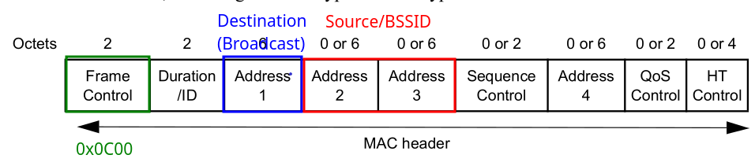

# Deauth Attack

> According to the 802.11 standard, deauthentication frames are not a request but a command that all stations must obey.

Since the frame just needs a sender or receiver MAC address and we can get that just form scanning making this attack very easy. 

## Protected Management Frames

Protected Management Frames (PMF) is a standard defined by WiFi Alliance to protect management frames from spoofing and eavesdropping. If a router has this implemented the attack above won't work. WPA3 by default requires PMF.

## Frame Structure (802.11 Standard 9.2.3)



### Reason Codes (Frame Body)

* **2:** Previous authentication no longer valid

## Deauth Frame

```c
uint8_t deauth_pkt[26] = {
  /* Frame Control: Subtype (0C = deauth, Type (0 = management frame), Version (0 = 802.11) */
  0x0C, 0x00, 
  /* Duration:  */
  0x00, 0x00, // Set to 0 
  0xFF, 0xFF, 0xFF, 0xFF, 0xFF, 0xFF, // Broadcast (2 Octets)
  0xCC, 0xCC, 0xCC, 0xCC, 0xCC, 0xCC, // Source after scan (2 Octets)
  0xCC, 0xCC, 0xCC, 0xCC, 0xCC, 0xCC, // BSSID after scan (2 Octets)
  0x00, 0x00, // Sequence Control (2 Octets)
  0x02, 0x00  // Frame Body (Reason Code = 2)
}; 
```

## Wireshark Filter

The following wireshark filter will show deauth and disassociation management frames.

```txt
# Looks for management frames that have the deauth or disassociation subtype
wlan.fc.type == 0 && (wlan.fc.type_subtype == 0x0c || wlan.fc.type_subtype == 0x0a)
```

# Resources

* https://blog.spacehuhn.com/wifi-deauthentication-frame
* https://howiwifi.com/2020/07/13/802-11-frame-types-and-formats/
